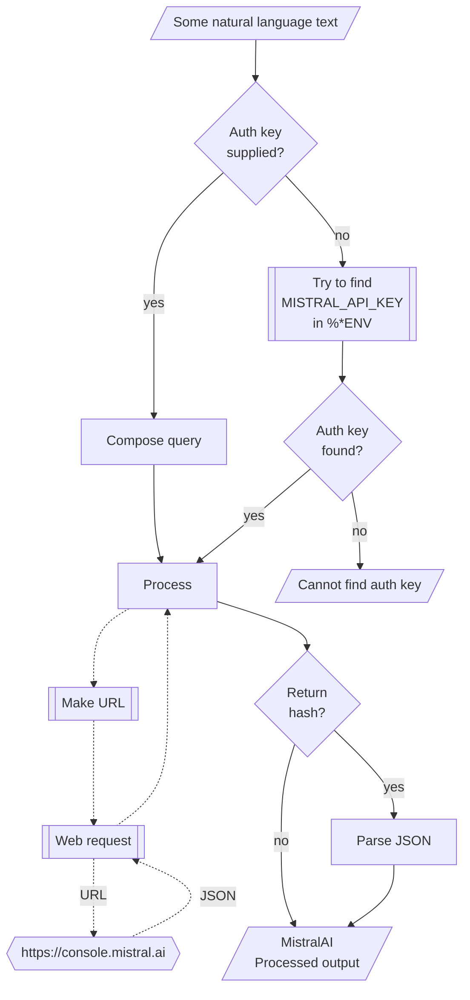

# WWW::MistralAI

## In brief

This Raku package provides access to the machine learning service [MistralAI](https://mistral.ai), [MAI1].
For more details of the MistralAI's API usage see [the documentation](https://docs.mistral.ai), [MAI2].

**Remark:** To use the MistralAI API one has to register and obtain authorization key.

**Remark:** This Raku package is much "less ambitious" than the official Python package, [MAIp1], developed by MistralAI's team.
Gradually, over time, I expect to add features to the Raku package that correspond to features of [MAIp1].

This package is very similar to the packages 
["WWW::OpenAI"](https://github.com/antononcube/Raku-WWW-OpenAI), [AAp1], and 
["WWW::PaLM"](https://github.com/antononcube/Raku-WWW-PaLM), [AAp2]. 

"WWW::MistralAI" can be used with (is integrated with) 
["LLM::Functions"](https://github.com/antononcube/Raku-LLM-Functions), [AAp3], and
["Jupyter::Chatbook"](https://github.com/antononcube/Raku-Jupyter-Chatbook), [AAp5].

Also, of course, prompts from 
["LLM::Prompts"](https://github.com/antononcube/Raku-LLM-Prompts), [AAp4],
can be used with MistralAI's functions.

-----

## Installation

Package installations from both sources use [zef installer](https://github.com/ugexe/zef)
(which should be bundled with the "standard" Rakudo installation file.)

To install the package from [Zef ecosystem](https://raku.land/) use the shell command:

```
zef install WWW::MistralAI
```

To install the package from the GitHub repository use the shell command:

```
zef install https://github.com/antononcube/Raku-WWW-MistralAI.git
```

----

## Usage examples

**Remark:** When the authorization key, `auth-key`, is specified to be `Whatever`
then the functions `mistralai-*` attempt to use the env variable `MISTRAL_API_KEY`.

### Universal "front-end"

The package has an universal "front-end" function `mistral-playground` for the 
[different functionalities provided by MistralAI](https://docs.mistral.ai).

Here is a simple call for a "chat completion":

```perl6
use WWW::MistralAI;
mistralai-playground('Where is Roger Rabbit?', max-tokens => 64);
```
```
# [{finish_reason => length, index => 0, message => {content => Roger Rabbit is a fictional character from animated films and Television. He first appeared in the 1988 live-action/animated film "Who Framed Roger Rabbit." Roger is a cartoon character residing in the fictional Toon Town, a part of the city of Los Angeles., role => assistant}}]
```

Another one using Bulgarian:

```perl6
mistralai-playground('Колко групи могат да се намерят в този облак от точки.', max-tokens => 64);
```
```
# [{finish_reason => length, index => 0, message => {content => To answer your question, I would need more information. The given phrase "този облак от точки" can be translated to "this cluster of points" in English. However, without knowing the specific data or context, it is impossible to determine how many groups or clusters can be found in this data set., role => assistant}}]
```

**Remark:** The function `mistralai-completion` can be used instead in the examples above. 


### Models

The current MistralAI models can be found with the function `mistralai-models`:

```perl6
mistralai-models
```
```
# ((Any))
```

### Code generation

There are two types of completions : text and chat. Let us illustrate the differences
of their usage by Raku code generation. Here is a text completion:

```perl6
mistralai-completion(
        'generate Raku code for making a loop over a list',
        max-tokens => 120,
        format => 'values');
```
```
# Here is an example of making a loop over a list in Raku:
# 
# ```raku
# my @list = (1, 2, 3, 4, 5); # Define a list
# 
# for my $item @list -> $_ {
#     # Do something with each item in the list
#     say "Current item: ", $_;
# }
# ```
# 
# In this example, we define a list `@list` and use the `for` loop to iterate through each item in the list. The `->` arrow operator is
```

Here is a chat completion:

```perl6
mistralai-completion(
        'generate Raku code for making a loop over a list',
        max-tokens => 120,
        format => 'values');
```
```
# In Raku, you can use the `loop` keyword along with the `given-when` construct to make a loop over a list. Here's an example:
# 
# ```raku
# my @list = (1, 2, 3, 4, 5);
# 
# loop @list -> $item {
#     say "$item";
# }
# ```
# 
# In the above code, we define a list `@list` with five elements. The `loop` statement iterates over each element in the list, assigning the current element
```


### Embeddings

Embeddings can be obtained with the function `mistralai-embeddings`. Here is an example of finding the embedding vectors
for each of the elements of an array of strings:

```perl6
my @queries = [
    'make a classifier with the method RandomForeset over the data dfTitanic',
    'show precision and accuracy',
    'plot True Positive Rate vs Positive Predictive Value',
    'what is a good meat and potatoes recipe'
];

my $embs = mistralai-embeddings(@queries, format => 'values', method => 'tiny');
$embs.elems;
```
```
# 4
```

Here we show:
- That the result is an array of four vectors each with length 1536
- The distributions of the values of each vector

```perl6
use Data::Reshapers;
use Data::Summarizers;

say "\$embs.elems : { $embs.elems }";
say "\$embs>>.elems : { $embs>>.elems }";
records-summary($embs.kv.Hash.&transpose);
```
```
# $embs.elems : 4
# $embs>>.elems : 1024 1024 1024 1024
# +----------------------------------+-----------------------------------+----------------------------------+-----------------------------------+
# | 3                                | 0                                 | 1                                | 2                                 |
# +----------------------------------+-----------------------------------+----------------------------------+-----------------------------------+
# | Min    => -0.088867              | Min    => -0.140381               | Min    => -0.091675              | Min    => -0.126343               |
# | 1st-Qu => -0.022064              | 1st-Qu => -0.019684               | 1st-Qu => -0.021881              | 1st-Qu => -0.021805               |
# | Mean   => -0.0014019259251654148 | Mean   => 0.0001275218091905117   | Mean   => -0.0014658444561064243 | Mean   => -0.00016893696738407016 |
# | Median => -0.0015511512756347656 | Median => -0.00012609362602233888 | Median => -0.0017815             | Median => 0.0005223751068115234   |
# | 3rd-Qu => 0.019516               | 3rd-Qu => 0.021347                | 3rd-Qu => 0.019943               | 3rd-Qu => 0.021469                |
# | Max    => 0.10968                | Max    => 0.088867                | Max    => 0.111755               | Max    => 0.097534                |
# +----------------------------------+-----------------------------------+----------------------------------+-----------------------------------+
```

Here we find the corresponding dot products and (cross-)tabulate them:

```perl6
use Data::Reshapers;
use Data::Summarizers;
my @ct = (^$embs.elems X ^$embs.elems).map({ %( i => $_[0], j => $_[1], dot => sum($embs[$_[0]] >>*<< $embs[$_[1]])) }).Array;

say to-pretty-table(cross-tabulate(@ct, 'i', 'j', 'dot'), field-names => (^$embs.elems)>>.Str);
```
```
# +---+----------+----------+----------+----------+
# |   |    0     |    1     |    2     |    3     |
# +---+----------+----------+----------+----------+
# | 0 | 1.000405 | 0.580262 | 0.736048 | 0.546892 |
# | 1 | 0.580262 | 1.000174 | 0.663682 | 0.534618 |
# | 2 | 0.736048 | 0.663682 | 1.000578 | 0.545032 |
# | 3 | 0.546892 | 0.534618 | 0.545032 | 0.999975 |
# +---+----------+----------+----------+----------+
````

**Remark:** Note that the fourth element (the cooking recipe request) is an outlier.
(Judging by the table with dot products.)

### Chat completions with engineered prompts

Here is a prompt for "emojification" (see the
[Wolfram Prompt Repository](https://resources.wolframcloud.com/PromptRepository/)
entry
["Emojify"](https://resources.wolframcloud.com/PromptRepository/resources/Emojify/)):

```perl6
my $preEmojify = q:to/END/;
Rewrite the following text and convert some of it into emojis.
The emojis are all related to whatever is in the text.
Keep a lot of the text, but convert key words into emojis.
Do not modify the text except to add emoji.
Respond only with the modified text, do not include any summary or explanation.
Do not respond with only emoji, most of the text should remain as normal words.
END
```
```
# Rewrite the following text and convert some of it into emojis.
# The emojis are all related to whatever is in the text.
# Keep a lot of the text, but convert key words into emojis.
# Do not modify the text except to add emoji.
# Respond only with the modified text, do not include any summary or explanation.
# Do not respond with only emoji, most of the text should remain as normal words.
```

Here is an example of chat completion with emojification:

```perl6
mistralai-chat-completion([ system => $preEmojify, user => 'Python sucks, Raku rocks, and Perl is annoying'], max-tokens => 200, format => 'values')
```
```
# Python 😕, Raku 🔥, Perl 💩
```

-------

## Command Line Interface

### Playground access

The package provides a Command Line Interface (CLI) script:

```shell
mistralai-playground --help
```
```
# Usage:
#   mistralai-playground [<words> ...] [--path=<Str>] [--mt|--max-tokens[=UInt]] [-m|--model=<Str>] [-r|--role=<Str>] [-t|--temperature[=Real]] [--response-format=<Str>] [-a|--auth-key=<Str>] [--timeout[=UInt]] [-f|--format=<Str>] [--method=<Str>] -- Command given as a sequence of words.
#   
#     --path=<Str>                Path, one of 'chat/completions', 'images/generations', 'images/edits', 'images/variations', 'moderations', 'audio/transcriptions', 'audio/translations', 'embeddings', or 'models'. [default: 'chat/completions']
#     --mt|--max-tokens[=UInt]    The maximum number of tokens to generate in the completion. [default: 100]
#     -m|--model=<Str>            Model. [default: 'Whatever']
#     -r|--role=<Str>             Role. [default: 'user']
#     -t|--temperature[=Real]     Temperature. [default: 0.7]
#     --response-format=<Str>     The format in which the response is returned. [default: 'url']
#     -a|--auth-key=<Str>         Authorization key (to use MistralAI API.) [default: 'Whatever']
#     --timeout[=UInt]            Timeout. [default: 10]
#     -f|--format=<Str>           Format of the result; one of "json", "hash", "values", or "Whatever". [default: 'Whatever']
#     --method=<Str>              Method for the HTTP POST query; one of "tiny" or "curl". [default: 'tiny']
```

**Remark:** When the authorization key argument "auth-key" is specified set to "Whatever"
then `mistralai-playground` attempts to use the env variable `MISTRAL_API_KEY`.


--------

## Mermaid diagram

The following flowchart corresponds to the steps in the package function `mistralai-playground`:



--------

## References

### Packages

[AAp1] Anton Antonov,
[WWW::OpenAI Raku package](https://github.com/antononcube/Raku-WWW-OpenAI),
(2023),
[GitHub/antononcube](https://github.com/antononcube).

[AAp2] Anton Antonov,
[WWW::PaLM Raku package](https://github.com/antononcube/Raku-WWW-PaLM),
(2023),
[GitHub/antononcube](https://github.com/antononcube).

[AAp3] Anton Antonov,
[LLM::Functions Raku package](https://github.com/antononcube/Raku-LLM-Functions),
(2023),
[GitHub/antononcube](https://github.com/antononcube).

[AAp4] Anton Antonov,
[LLM::Prompts Raku package](https://github.com/antononcube/Raku-LLM-Prompts),
(2023),
[GitHub/antononcube](https://github.com/antononcube).

[AAp5] Anton Antonov,
[Jupyter::Chatbook Raku package](https://github.com/antononcube/Raku-Jupyter-Chatbook),
(2023),
[GitHub/antononcube](https://github.com/antononcube).

[MAI1] MistralAI, [MistralAI platform](https://mistral.ai).

[MAI2] MistralAI Platform documentation, [MistralAI documentation](https://docs.mistral.ai).

[MAIp1] MistralAI,
[https://github.com/mistralai/client-python),
(2023),
[GitHub/mistralai](https://github.com/mistralai).

